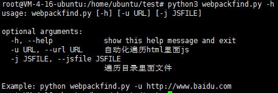
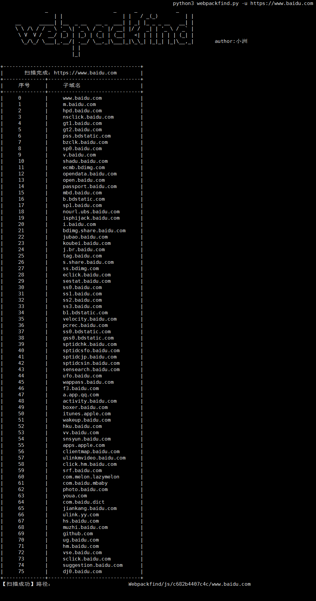
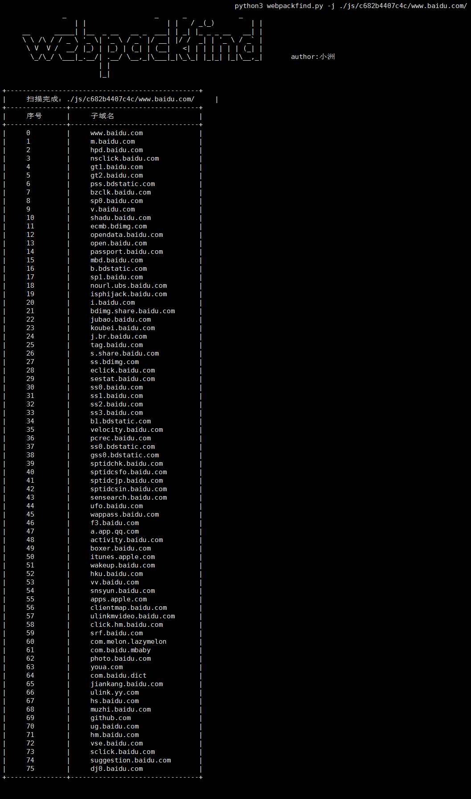
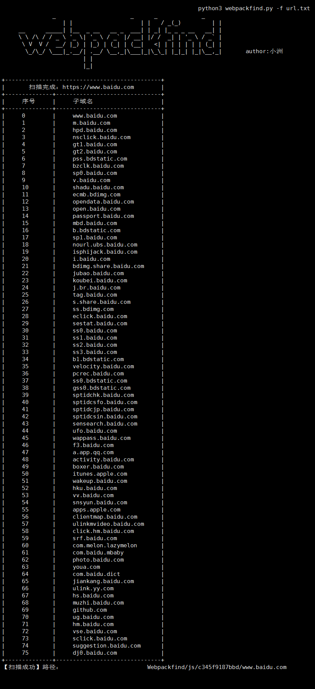

# Webpackfind-信息收集工具

郑重声明：文中所涉及的技术、思路和工具仅供以安全为目的的学习交流使用，任何人不得将其用于非法用途以及盈利等目的，否则后果自行承担。

## 0x01 介绍

作者：[小洲](https://github.com/xz-zone)

团队：[横戈安全团队](imgs/logo.jpg)，未来一段时间将陆续开源工具，欢迎关注微信公众号：


定位：协助红队人员快速的信息收集，测绘目标资产，寻找薄弱点。

语言：python3开发

功能：一条龙服务，只需要输入根域名即可一键化收集敏感信息。具体案例见下文。

调用：
* 脚本借用了JSFinderjs内容提取脚本，感谢Threezh1作者。
* 脚本借用了HaE内容提取脚本，感谢gh0stkey作者。

支持环境：Ubuntu、Centos、Windows。


## 0x02 安装

为了避免踩坑,建议安装在如下环境中

* 当前用户对该目录有写权限，不然扫描结果无法生成。root权限即可
* Python环境必须是3.7以上，因为使用了异步。建议VPS环境是ubuntu20，默认是python3.8。安装模块的时候切记不要走豆瓣的源

```
Ubuntu 运行环境
chmod 777 build.sh
./build.sh

Windows模块安装
python3 -m pip install -r requirements.txt
```


`python3 webpackfind.py`



## 0x03 效果展示

自动爬取网站



自动爬取本地文件



读取txt循环读取url



## 0x04 使用方法 

| 语法                                                       | 功能                                          |
| :------------------------------------------------------- | :-------------------------------------------- |
| python3 webpackfind.py -u http://domain.com            	   	| 自动化遍历URL中里面js                           |
| python3 webpackfind.py -j ./js/test.com/                   	| 遍历本地目录中的js文件并且格式化js文件、提取信息泄露                            |
| python3 webpackfind.py -f ./url.txt    | 读取本地url文件批量遍历url中js                            |
| python3 webpackfind.py -c "name=test;" -u http://domain.com    | 设置自定义Cookie，场景:需要登录才能爬取js信息                            |
| python3 webpackfind.py -update 1    | 检查本地`webpackfind.py`是否与github.com是否一致                            |

## 0x05 版本更新

2021-08-17 初始版本提交

2021-08-18 版本整体修改为面向对象编程，自动识别是否存在其他子域名


2021-08-19 修复build.sh 不能执行问题

2021-08-23 修复了manifest js无法读取遍历BUG，感谢 chhyx2 师傅提交的bug。

2021-08-24 优化细节,解决windows生成目录问题。

2021-08-26 优化细节,解决获取js路径问题,添加读取文本url地址进行扫描js。

2021-09-02 优化细节,解决PhantomJS给拦截问题。

2021-09-03 优化细节,解决提取域名正则问题。

2021-09-07 优化细节,解决目录名称更好查找，添加自动判断是否更新。

2021-09-22 优化细节,解决首页存在webpackjs代码问题。

2022-07-21 优化细节,解决本地js代码文件未格式化问题,优化加更新参数才检查更新。

2022-08-22 重构核心代码,兼容更多webpack版本问题。

2022-08-23 优化细节,优化批量扫描,解决写入路径问题,增加Cookies认证遍历读取。

2022-08-24 优化phantomjs文件过大问题,优化提示文字,增加协议识别模块。

2022-08-25 优化细节，增加批量扫描单线程改多线程。

2022-08-27 优化线程池问题,增加“HaE”规则库。

2022-08-30 增加进度条，自动化识别路径Url。

## 0x06 反馈

Webpackfind 是一个免费且开源的项目，我们欢迎任何人为其开发和进步贡献力量。

* 在使用过程中出现任何问题，可以通过 issues 来反馈。
* Bug 的修复可以直接提交 Pull Request 到 dev 分支。
* 如果是增加新的功能特性，请先创建一个 issue 并做简单描述以及大致的实现方法，提议被采纳后，就可以创建一个实现新特性的 Pull Request。
* 欢迎对说明文档做出改善，帮助更多的人使用 Webpackfind。
* 贡献代码请提交 PR 至 dev 分支，master 分支仅用于发布稳定可用版本。

*提醒：和项目相关的问题最好在 issues 中反馈，这样方便其他有类似问题的人可以快速查找解决方法，并且也避免了我们重复回答一些问题。*

## Stargazers over time

[](https://starchart.cc/xz-zone/Webpackfind)

