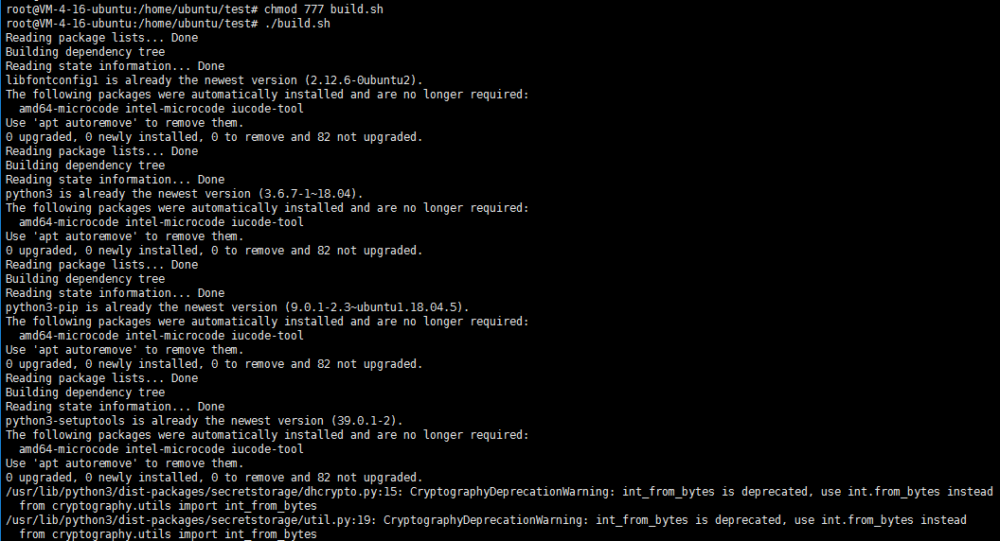

# Webpack-信息收集工具

郑重声明：文中所涉及的技术、思路和工具仅供以安全为目的的学习交流使用，任何人不得将其用于非法用途以及盈利等目的，否则后果自行承担。

## 0x01 介绍

作者：[小洲](https://github.com/xz-zone)

团队：[横戈安全团队](imgs/logo.jpg)，未来一段时间将陆续开源工具，欢迎关注微信公众号：


定位：协助红队人员快速的信息收集，测绘目标资产，寻找薄弱点。

语言：python3开发

功能：一条龙服务，只需要输入根域名即可一键化收集敏感信息。具体案例见下文。


## 0x02 安装

为了避免踩坑,建议安装在如下环境中

* 当前用户对该目录有写权限，不然扫描结果无法生成。root权限即可
* Python环境必须是3.7以上，因为使用了异步。建议VPS环境是ubuntu20，默认是python3.8。安装模块的时候切记不要走豆瓣的源

```
chmod 777 build.sh
./build.sh
```


`python3 webpackfind.py -h`


## 0x03 效果展示

自动爬取网站


自动爬取本地文件


## 0x04 使用方法 

| 语法                                                       | 功能                                          |
| :------------------------------------------------------- | :-------------------------------------------- |
| python3 webpackfind.py -u domain.com            	   	| 采集域名中的webpack                           |
| python3 webpackfind.py -j ./js                   	| 本地读取js信息收集                            |


## 0x05 版本更新

2021-08-17 初始版本提交

2021-08-18 版本整体修改为面向对象编程，自动识别是否存在其他子域名


## 0x05 反馈

Webpackfind 是一个免费且开源的项目，我们欢迎任何人为其开发和进步贡献力量。

* 在使用过程中出现任何问题，可以通过 issues 来反馈。
* Bug 的修复可以直接提交 Pull Request 到 dev 分支。
* 如果是增加新的功能特性，请先创建一个 issue 并做简单描述以及大致的实现方法，提议被采纳后，就可以创建一个实现新特性的 Pull Request。
* 欢迎对说明文档做出改善，帮助更多的人使用 ShuiZe。
* 贡献代码请提交 PR 至 dev 分支，master 分支仅用于发布稳定可用版本。

*提醒：和项目相关的问题最好在 issues 中反馈，这样方便其他有类似问题的人可以快速查找解决方法，并且也避免了我们重复回答一些问题。*


